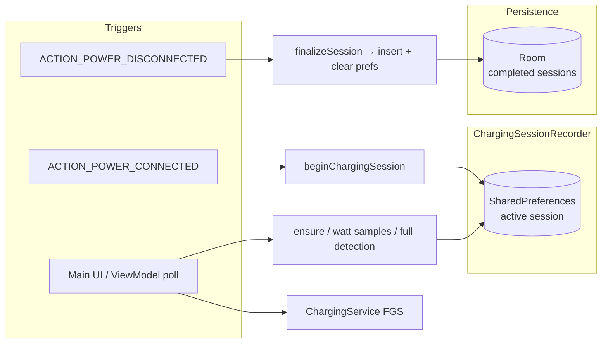

# VoltTrack

<p align="center">
  <strong>Live battery and charging analytics for Android</strong><br/>
  <sub>Track input power, session gain, and history — while you charge and after you unplug.</sub>
</p>

---

## What is VoltTrack?

**VoltTrack** is a native Android app that monitors your device while it is on external power. It shows **battery level** (with finer-than-integer precision where the device supports it), **estimated input power in watts**, and a full log of **charging sessions** — from plug-in to unplug.

Each completed session records **start/end time**, **percentage gained**, **peak wattage**, and (when the OS reports it) **the moment charging reached "full"** while still plugged in. Sessions are grouped by calendar day with collapsible summaries so you can review patterns over time.

## Screenshots

<table>
  <tbody>
    <tr>
      <td align="center"><strong>Intro Screen</strong></td>
      <td align="center"><strong>Current/Today session</strong></td>
      <td align="center"><strong>Recent Session Overview</strong></td>
      <td align="center"><strong>Interactive Charts</strong></td>
    </tr>
    <tr>
      <td></td>
      <td></td>
      <td></td>
      <td></td>
    </tr>
    <tr>
      <td align="center"><strong>Settings</strong></td>
      <td align="center"><strong>Battery Goal Alert</strong></td>
      <td align="center"><strong>Privacy Page</strong></td>
      <td align="center"><strong>Dark Mode</strong></td>
    </tr>
    <tr>
      <td></td>
      <td></td>
      <td></td>
      <td></td>
    </tr>
  </tbody>
</table>

---

## Features

| Area | What you get |
|------|--------------|
| **Live dashboard** | Battery %, smoothed input power (W or mW), updated on a configurable interval. |
| **Current session card** | In-progress charge — gain so far, duration, peak watts, "charge completed" time if observed. |
| **Session history** | Completed sessions grouped by day, collapsible with a per-day summary. |
| **KPI Summary** | Instant insights on Avg. Duration, Total Gained, Avg. Peak Power, and Peak Temp. |
| **Interactive Charts** | Multi-range (7D/14D/30D/All) charts for Power Trends, Temperature Safety, and Charging Habits. |
| **Smart Alerts** | Intelligent notifications for Overheating and Slow Charging with change-based triggers. |
| **Theme Customization** | Choose between Dynamic (Material You) or 5 curated accent colors (Purple, Blue, Green, Orange, Rose). |
| **Battery goal alert** | Optional notification when battery reaches your target % while plugged in. |
| **Onboarding** | First-run screen covering monitoring, estimates, notifications, and permission request. |
| **Privacy screen** | In-app explanation of local-only storage, permissions, and estimate accuracy. |
| **Settings** | Theme (Light/Dark/System), Accent Color, Power Unit (W/mW), Refresh Interval (1s–10s), Alerts, and Goal. |

---

## How it works



**1. Plug in**
- `PowerReceiver` or the **ViewModel loop** detects external power and starts a session via `ChargingSessionRecorder`.
- Active session data lives in **SharedPreferences** until finalize — surviving process death during fast unplugs.

**2. While charging**
- `MainViewModel` and `ChargingService` poll `BatteryMonitor` for plug state, %, watts, and temperature.
- `AlertManager` intelligently monitors for overheating or slow charging speed drops.
- `ChargingService` captures the exact "Full" battery timestamp even when the app is closed.

**3. Unplug**
- The session is finalized, built into a `ChargingSession` object, and inserted into **Room**.
- A "session saved" notification is posted, and history updates instantly.

---

## Architecture

| Layer | Role |
|-------|------|
| **UI** | `MainActivity` → `VoltTrackNavHost` → Screens for Main, Charts, Settings, Privacy, and Onboarding. |
| **ViewModel** | `MainViewModel` — Dashboard state & charging loop; `SettingsViewModel` — Preferences proxy. |
| **Repository** | `SessionRepository` — Room abstraction; `PreferencesRepository` — DataStore implementation. |
| **Notification** | `AlertManager` — Intelligent alert logic; `NotificationHelper` — UI notification builders. |
| **Data** | Room Database (v2), SharedPreferences, and DataStore Preferences. |
| **Logic** | `BatteryMonitor` — Raw OS battery data parser; `ChartAggregation` — Multi-range analytics engine. |
| **System** | `ChargingService` (Background FGS), `PowerReceiver` (Connectivity broadcasts). |

---

## Tech stack

| Category | Details |
|----------|---------|
| **Language** | Kotlin 2.0.21 (JVM 11) |
| **UI** | Jetpack Compose, Material 3, Navigation Compose 2.8.4 |
| **Async** | Kotlin Coroutines, Flow, StateFlow |
| **Lifecycle** | AndroidViewModel, `lifecycle-runtime-compose` (`collectAsStateWithLifecycle`) |
| **Storage** | Room 2.6.1 (KAPT), DataStore Preferences 1.1.1, SharedPreferences |
| **Build** | AGP 8.12.3, Gradle 8.13, `compileSdk` / `targetSdk` 36, `minSdk` 25 |

---

## Permissions

| Permission | Purpose |
|------------|---------|
| `FOREGROUND_SERVICE` | Run `ChargingService` in the foreground while monitoring. |
| `FOREGROUND_SERVICE_DATA_SYNC` | Declares the foreground service type required on Android 14+. |
| `POST_NOTIFICATIONS` | Show the ongoing service notification and session/goal alerts (Android 13+). |

---

## Building & running

**Requirements:** Android Studio (latest stable), JDK 11+, Android SDK 36.

```bash
# Clone and build from the command line:
./gradlew :app:assembleDebug   # build
./gradlew :app:installDebug    # install
```

Run on a **physical device** for accurate wattage readings — emulators do not expose real battery current data.

---

## Project metadata

| Field | Value |
|-------|-------|
| **Application ID** | `com.codecraft.volttrack` |
| **Version name** | `1.0` |
| **Version code** | `1` |

---

## Notes & limitations

- **Watt estimates** are derived from device-reported voltage and current. OEM implementations vary; values are for trend analysis.
- **Background Capture**: The app records "Charging Completed" events in the background via the foreground service.
- **Material You**: Dynamic colors are prioritized on Android 12+, with curated fallbacks for all users.
- **Room Migration**: Migration from v1 to v2 adds the `chargeCompletedAtMs` support.

---

<p align="center">
  Built with Kotlin · Compose · Room<br/>
  <sub>VoltTrack — know your charge.</sub>
</p>
