# VoltTrack

<p align="center">
  <strong>Live battery and charging analytics for Android</strong><br/>
  <sub>Track input power, session gain, and history — while you charge and after you unplug.</sub>
</p>

---

## What is VoltTrack?

**VoltTrack** is a native Android app that monitors your device while it is on external power. It shows **battery level** (with finer-than-integer precision where the device supports it), **estimated input power in watts**, and a full log of **charging sessions** — from plug-in to unplug.

Each completed session records **start/end time**, **percentage gained**, **peak wattage**, and (when the OS reports it) **the moment charging reached "full"** while still plugged in. Sessions are grouped by calendar day with collapsible summaries so you can review patterns over time.

## Screenshots

<table>
  <tbody>
    <tr>
      <td align="center"><strong>Intro Screen</strong></td>
      <td align="center"><strong>Current/Today session</strong></td>
      <td align="center"><strong>Recent Session Overview</strong></td>
      <td align="center"><strong>7-Day Chart</strong></td>
    </tr>
    <tr>
      <td></td>
      <td></td>
      <td></td>
      <td></td>
    </tr>
    <tr>
      <td align="center"><strong>Settings</strong></td>
      <td align="center"><strong>Battery Goal Alert</strong></td>
      <td align="center"><strong>Privacy Page</strong></td>
      <td align="center"><strong>Dark Mode</strong></td>
    </tr>
    <tr>
      <td></td>
      <td></td>
      <td></td>
      <td></td>
    </tr>
  </tbody>
</table>

---

## Features

| Area | What you get |
|------|--------------|
| **Live dashboard** | Battery %, smoothed input power (W or mW), updated on a configurable interval |
| **Current session card** | In-progress charge — gain so far, duration, peak watts, "charge completed" time if observed |
| **Session history** | Completed sessions grouped by day (Today / Yesterday / full date), collapsible with a per-day summary |
| **7-day chart** | Bar chart of total time on charger per calendar day, last 7 days |
| **Battery goal alert** | Optional notification when battery reaches your target % while plugged in |
| **Onboarding** | First-run screen covering monitoring, estimates, notifications, and notification permission request |
| **Privacy screen** | In-app explanation of local-only storage, permissions, and estimate accuracy |
| **Settings** | Theme (Light / Dark / System), power unit (W / mW), refresh interval (1 s – 10 s), goal toggle + target % |
| **Background monitoring** | Foreground service (when allowed) keeps monitoring alive with a persistent notification |

---

## How it works

```mermaid
flowchart LR
    subgraph triggers [Triggers]
        BC[ACTION_POWER_CONNECTED]
        BD[ACTION_POWER_DISCONNECTED]
        UI[Main UI / ViewModel poll]
    end

    subgraph recorder [ChargingSessionRecorder]
        PREF[(SharedPreferences\nactive session)]
    end

    subgraph persist [Persistence]
        ROOM[(Room\ncompleted sessions)]
    end

    BC --> begin[beginChargingSession]
    BD --> fin[finalizeSession → insert + clear prefs]
    UI --> ensure[ensure / watt samples / full detection]
    begin --> PREF
    ensure --> PREF
    fin --> ROOM
    UI --> FGS[ChargingService FGS]
```



**1. Plug in**
- `PowerReceiver` calls `beginChargingSession`, or the **ViewModel loop** detects external power and starts a session.
- Active session data lives in **SharedPreferences** until finalize — surviving process death during fast unplugs.

**2. While charging**
- `MainViewModel` polls `BatteryMonitor`: plug state, %, watts, smoothing, and updates **peak watts** and **charge-completed timestamp** via `ChargingSessionRecorder`.
- `ChargingService` (foreground) also samples watts on the same interval.
- The UI reads **Room** for history and the **prefs snapshot** for the current-session card.

**3. Unplug**
- `PowerReceiver` runs `finalizeSessionBlocking`, or the UI loop calls `finalizeSession`: builds a `ChargingSession`, inserts into Room, clears prefs, and posts a "session saved" notification.
- The new row appears immediately under **Recent Sessions**.

**4. Return to foreground**
- On `Activity.onStart`, the app checks charging state and aligns session tracking, starting the foreground service if needed.

---

## Architecture

| Layer | Role |
|-------|------|
| **UI** | `MainActivity` → `VoltTrackNavHost` → `MainScreen`, `ChartsScreen`, `SettingsScreen`, `PrivacyScreen`, `OnboardingScreen` (all Compose) |
| **ViewModel** | `MainViewModel` — `MainUiState` (`StateFlow`): battery %, watts, active session, session list, collapsed day keys, charging loop, goal notification logic |
| **ViewModel** | `SettingsViewModel` — proxies `PreferencesRepository` writes; exposes prefs as `StateFlow` |
| **Repository** | `SessionRepository` — exposes `Flow<List<ChargingSession>>` from Room |
| **Preferences** | `PreferencesRepository` — DataStore-backed; theme, power unit, refresh interval, goal settings |
| **Data** | `ChargingSession` entity + `SessionDao`, `AppDatabase` (Room v2 with migration), `ChargingSessionRecorder` (active session in prefs + finalize → Room) |
| **Logic** | `BatteryMonitor` — precision level, current watts, plug detection; handles OEM unit ambiguity |
| **System** | `ChargingService` (foreground, `dataSync` type), `PowerReceiver` (power connect/disconnect broadcasts) |

```
com.volttrack.app
├── MainActivity.kt
├── VoltTrackApplication.kt         # Notification channel setup on app start
├── data/
│   ├── ChargingSession.kt          # Room entity + DAO + AppDatabase (v2)
│   ├── ChargingSessionRecorder.kt  # Active session (SharedPreferences) + finalize → Room
│   ├── preferences/
│   │   ├── PreferencesRepository.kt
│   │   └── UserPreferences.kt      # ThemePreference, PowerUnit enums
│   └── repository/
│       └── SessionRepository.kt
├── logic/
│   └── BatteryMonitor.kt
├── notification/
│   ├── NotificationChannels.kt     # Three channels: service, session events, goals
│   └── NotificationHelper.kt
├── receiver/
│   └── PowerReceiver.kt
├── service/
│   └── ChargingService.kt
└── ui/
    ├── VoltTrackAppContent.kt      # Theme wrapper
    ├── VoltTrackNavHost.kt         # Navigation graph + bottom bar
    ├── PowerDisplay.kt             # W / mW formatting
    ├── SessionUiFormatting.kt      # Date grouping, duration, summary lines
    ├── StatusBarStyle.kt
    ├── charts/
    │   ├── ChartAggregation.kt     # 7-day bar data aggregation
    │   └── ChartsScreen.kt
    ├── main/
    │   ├── MainViewModel.kt
    │   └── MainScreen.kt
    ├── onboarding/
    │   └── OnboardingScreen.kt
    ├── settings/
    │   ├── SettingsViewModel.kt
    │   ├── SettingsScreen.kt
    │   └── PrivacyScreen.kt
    └── theme/
        ├── Color.kt
        ├── Theme.kt                # Material You dynamic color (Android 12+), Light/Dark fallback
        └── Type.kt
```

---

## Tech stack

| Category | Details |
|----------|---------|
| **Language** | Kotlin 2.0.21 (JVM 11) |
| **UI** | Jetpack Compose, Material 3, Navigation Compose 2.8.4 |
| **Async** | Kotlin Coroutines, Flow, StateFlow |
| **Lifecycle** | AndroidViewModel, `lifecycle-runtime-compose` (`collectAsStateWithLifecycle`) |
| **Storage** | Room 2.6.1 (KAPT), DataStore Preferences 1.1.1, SharedPreferences (active session) |
| **Build** | AGP 8.12.3, Gradle 8.13, `compileSdk` / `targetSdk` 36, `minSdk` 25 |
| **Testing** | JUnit 4, Google Truth, Coroutines Test, Room in-memory testing |

---

## Permissions

| Permission | Purpose |
|------------|---------|
| `FOREGROUND_SERVICE` | Run `ChargingService` in the foreground while monitoring |
| `FOREGROUND_SERVICE_DATA_SYNC` | Declares the foreground service type required on Android 14+ |
| `POST_NOTIFICATIONS` | Show the ongoing service notification and session/goal alerts (Android 13+) |

---

## Building & running

**Requirements:** Android Studio (latest stable), JDK 11+, Android SDK 36.

```bash
# Clone and open the project root in Android Studio, or build from the command line:

# macOS / Linux
./gradlew :app:assembleDebug

# Windows (PowerShell)
.\gradlew :app:assembleDebug

# Install on a connected device or running emulator (API 25+)
./gradlew :app:installDebug
```

Run the app on a physical device for accurate wattage readings — emulators do not expose real battery current data.

---

## Tests

The project has three test suites:

| Test | Type | What it covers |
|------|------|----------------|
| `ChartAggregationTest` | Unit | `aggregateChargeTimeByDay` — empty list, same-day duration summing |
| `MainViewModelGoalLogicTest` | Unit | Goal-fire logic (enabled/disabled, threshold boundary) |
| `SessionDaoTest` | Instrumented | Room DAO insert + Flow emission on an in-memory database |

```bash
# Unit tests
./gradlew :app:test

# Instrumented tests (requires a connected device or emulator)
./gradlew :app:connectedAndroidTest
```

---

## Project metadata

| Field | Value |
|-------|-------|
| **Application ID** | `com.volttrack.app` |
| **Version name** | `1.0` |
| **Version code** | `1` |

---

## Notes & limitations

- **Watt estimates** are derived from device-reported voltage and current (`BatteryManager`). OEM implementations vary widely — values are useful for trends, not lab-grade measurement.
- **Foreground service** start rules differ by Android version. The app handles `ForegroundServiceStartNotAllowedException` and `SecurityException` gracefully; session tracking continues via SharedPreferences and the ViewModel path even if the service cannot start.
- **`ACTION_POWER_CONNECTED`** does not launch the foreground service directly (blocked on Android 12+ in background). The service starts from the ViewModel when the app is in the foreground.
- **Room database** is at version 2. The migration from v1 adds the `chargeCompletedAtMs` column.

---

## Future ideas

Not a committed roadmap — ideas worth considering as VoltTrack grows.

| Direction | Idea |
|-----------|------|
| **Home screen widget** | Glanceable current %, watts, or last session summary |
| **Export / backup** | CSV or JSON of sessions for spreadsheets or device transfers |
| **Session detail** | Tap a row → full breakdown, optional notes, safe delete |
| **Cost estimate** | Optional $/kWh (user-entered) × rough session energy |
| **Wear OS / Quick Settings tile** | Power-user glance |
| **Opt-in crash reporting** | e.g. Crashlytics, with updated privacy disclosure |
| **Play Store** | Screenshots, short video, clear estimate disclaimer |
| **KSP migration** | Replace KAPT with KSP for Room compiler (faster incremental builds) |

---

## License

Add your preferred license here (e.g. MIT, Apache-2.0) once you decide how you want VoltTrack distributed.

---

<p align="center">
  Built with Kotlin · Compose · Room<br/>
  <sub>VoltTrack — know your charge.</sub>
</p>
